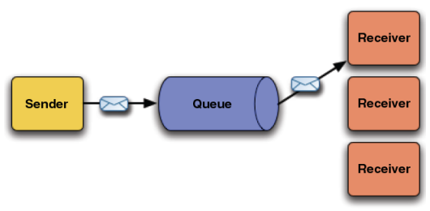
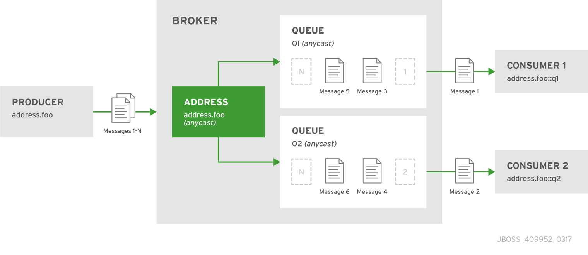
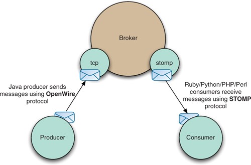
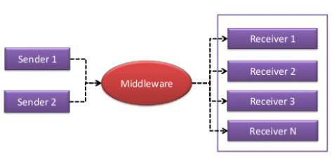
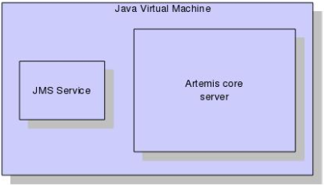
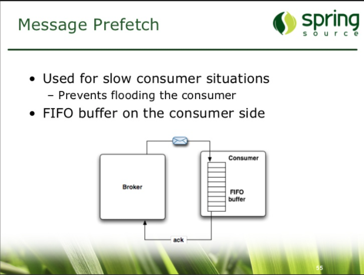

#
## Point-to-Point (Queue)
#

#

## Mensagem (Message/Event)
---
    Uma Message é um pequeno "pacote" com dados, este pacote é enviado a canais que se responsabilizam por entregar esses pacotes aos sistemas interessados.  
    Pode ser um JSON, XML ou qualquer tipo de formato em bytes.

    Resumo do editor: Pense em uma carta.
---
## Produtor (Producer/Sender)
    Producer é um programa que gera uma mensagem e envia para uma Queue.

    - Resumo do editor: É quem envia uma ou mais cartas.

## Fila (Queue)
    Queue é uma sequência de mensagens enfileiradas aguardando para serem removidas.

    - Resumo do editor: Pense em uma caixa cheia de cartas empilhadas em uma agência dos correios.
    
## Consumidor (Consumer/Receiver)
    Consumer é um programa que recebe as mensagens e retira da Queue.

    - Resumo do editor: É quem recebe uma ou mais cartas.

#

#

## Agente de mensagens (Message Broker)
    Um Message Broker nada mais é que um servidor de mensagens, responsável por garantir que a mensagem seja enfileirada e armazenada em disco (opcional), garantindo que ela fique lá enquanto necessário até que alguém (consumidor) a retire.
    - ActiveMQ 

    - Resumo do editor: Pense em uma agência de correios.

#

## Mensageria
    Mensageria é uma maneira de sistemas distribuidos se comunicarem por meio de troca de mensagens (event), sendo estas mensagens “gerenciadas” por um intermediário (Message Broker).
    
    - Resumo do editor: Usar a palavra mensageria pode ser uma forma de referênciar todos os 2 bilhões de termos técnicos do assunto.

#

#
## Mundo Real 

- Integrar sistemas desenvolvidos em tecnologias diferentes.

- Processar requisições de forma assíncrona e com escalabilidade.

#
## Fontes
- Conceitos de Mensageria: <a href="https://pt.slideshare.net/waelsonn/1conceitos-de-mensageria">link</a>
- Mensageria: <a href="https://medium.com/@devbrito91/mensageria-1330c6032049">link</a>
- Enfileiramento de Mensagens: <a href="https://www.ibm.com/docs/pt-br/ibm-mq/9.0?topic=ssfksj-9-0-0-com-ibm-mq-pro-doc-q002620--htm">link</a>
- Point-to-Point Messaging: <a href="https://access.redhat.com/documentation/en-us/red_hat_amq/7.2/html/using_amq_broker/addresses">link</a>
- ActiveMQ, How do I preserve order of messages? <a href="https://activemq.apache.org/how-do-i-preserve-order-of-messages">link</a>
- <a href="">link</a>

#

## Advanced

#
## Message Oriented Middleware (MOM) <a href="https://activemq.apache.org/mom">link</a>
    Message Oriented Middleware (MOM) é um tipo de middleware orientado à mensagem. 

##  Java Message Service (JMS)
    Java Message Service, ou JMS, é uma API da linguagem Java para middleware orientado a mensagens. Através da API JMS, duas ou mais aplicações podem se comunicar por mensagens.

## Message (event)
    - A message is the unit of data which is sent between clients and servers.
    - A message has a body which is a buffer containing convenient methods for reading and writing data into it.

## Point-to-Point - Queue 
    With this type of messaging you send a message to a queue. The message is then typically persisted to provide a guarantee of delivery, then some time later the messaging system delivers the message to a consumer. 

## Publish-Subscribe - (topics, pub/sub)
- <a href="https://access.redhat.com/documentation/en-us/red_hat_amq/7.2/html/using_amq_broker/addresses">link</a>

## Protocols
- Openwire: <a href="https://activemq.apache.org/wire-protocol">Link</a>
- Openwire is built ontop of TCP: <a href="https://activemq.apache.org/openwire">link</a>

## Skiped session
- The Publish-Subscribe Pattern 
    - skip
- Delivery guarantees    
    - skip
- Transactions
    - skip
- Durability
    - skip
- Messaging APIs and protocols
    - skip
- Routing <a herf="https://activemq.apache.org/components/artemis/documentation/2.0.0/address-model.html">Link</a>   
    - skip
- ...
    - skip

## Architecture
- 

## Concepts

- messaging-concepts:<a href="https://activemq.apache.org/components/artemis/documentation/2.0.0/messaging-concepts.html">Link</a>

#
##
<a href="https://pt.slideshare.net/bruce.snyder/enterprise-messaging-with-activemq-and-spring-jms">messaging-with-activemq-and-spring-jms</a>

A protocol - A set of rules.

AMQP - AMQP is an open internet protocol for reliably sending and receiving messages.

MOM (message-oriented-middleware) - is an approach, an architecture for distributed system i.e. a middle layer for the whole distributed system, where there's lot of internal communication (a component is querying data, and then needs to send it to the other component, which will be doing some processing on the data) so components have to share info/data among them.

Message broker - is any system (in MOM) which handles messages (sending as well as receiving), or to be more precise which routes messages to the specific consumer/recipient. A Message Broker is typically built upon a MOM. The MOM provides the base communication among the applications, and things like message persistence and guaranteed delivery. "Message brokers are a building block of Message oriented middleware."

Rabbitmq - a message broker; a MOM implementation; an open-source implementation of AMQP; as per Wikipedia:

## commands

kubectl port-forward svc/lb-activemq 8161:8161 -n dev
kubectl port-forward svc/lb-activemq 61616:61616 -n dev
kubectl port-forward deployment.apps/deploy-prometheus 9090:9090 -n dev
kubectl port-forward svc/lb-grafana 3000:3000 -n dev

kubectl scale deployment deploy-app-receiver --replicas=1 -n dev

java -cp app.jar com.activemq.producer.Producer "bla.bla" 20 "tcp://localhost:61616"
java -cp app.jar com.activemq.consumer.Consumer

docker run -it --rm -eBROKER="tcp://activemq:61616" -eCLASS="com.activemq.consumer.Consumer" -eQUEUE="bla.bla" -eMSGS="1"  activemq:dev